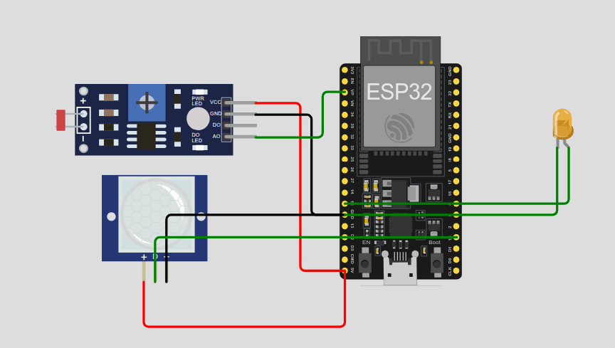
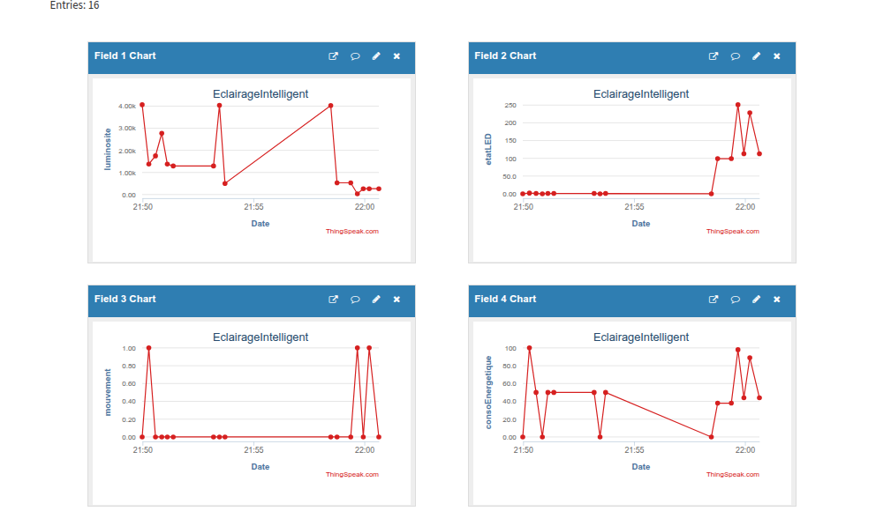

# 💡 Système d'Éclairage Intelligent IoT


## 📌 Description

Système d'éclairage automatique intelligent qui **ajuste dynamiquement l'intensité lumineuse** en fonction de :
- 🌙 **L'obscurité ambiante** (capteur LDR)
- 🚶 **La présence de mouvement** (capteur PIR)
  


Le système envoie les données en temps réel vers **ThingSpeak** pour monitoring et analyse de consommation énergétique.

---

## 🎯 Objectif

**Réduire la consommation énergétique** en adaptant intelligemment l'éclairage :
- ☀️ **Jour** : LED éteinte (luminosité naturelle suffisante)
- 🌙 **Nuit avec mouvement** : LED à intensité maximale (100%)
- 🌙 **Nuit sans mouvement** : LED à intensité réduite (50%)

**Applications concrètes :**
- Éclairage public intelligent
- Parkings souterrains
- Couloirs d'immeubles
- Espaces de travail
- Entrepôts

---

## 🧠 Logique et Fonctionnement

### Architecture du Système

```
┌─────────────┐      ┌─────────────┐      ┌──────────────┐
│  Capteur    │─────▶│             │      │              │
│  LDR        │      │             │      │  ThingSpeak  │
└─────────────┘      │   ESP32     │─────▶│   Cloud      │
                     │             │ WiFi │  Dashboard   │
┌─────────────┐      │   Logique   │      │              │
│  Capteur    │─────▶│   PWM       │      └──────────────┘
│  PIR        │      │             │
└─────────────┘      │             │
                     └──────┬──────┘
                            │
                            ▼
                     ┌─────────────┐
                     │   LED       │
                     │  (Orange)   │
                     └─────────────┘
```
## 📌 Diagrammes et Visualisations

### Schéma du Circuit


### Dashboard ThingSpeak


---
### Algorithme de Décision

#### 🔍 **Étape 1 : Lecture des Capteurs**
```cpp
luminosite = analogRead(LDR_PIN);  // Valeur 0-4095 (ADC 12-bit)
mouvement = digitalRead(PIR_PIN);  // HIGH (1) ou LOW (0)
```

**Interprétation LDR :**
- `0-1000` → Très sombre (nuit profonde)
- `1000-2000` → Sombre (fin de journée)
- `2000+` → Lumineux (jour)

#### 🧮 **Étape 2 : Détermination du Mode**

```
┌─────────────────────────────────────────┐
│  Luminosité < 2000 (seuilNuit) ?        │
└────────────┬────────────────────────────┘
             │
        ┌────┴────┐
        │   NON   │ → LED = 0 (OFF) ─────────────────┐
        └─────────┘                                   │
        │   OUI   │ → MODE NUIT                       │
        └────┬────┘                                   │
             │                                        │
    ┌────────┴─────────┐                             │
    │  Mouvement ?     │                             │
    └────┬─────────────┘                             │
         │                                            │
    ┌────┴────┐                                      │
    │   OUI   │ → LED = Intensité MAXIMALE           │
    │         │   (mapping proportionnel)            │
    └─────────┘                                      │
    │   NON   │ → LED = Intensité RÉDUITE (50%)      │
    │         │   (mode économie)                    │
    └─────────┘                                      │
         │                                            │
         └────────────────────────────────────────────┤
                                                      │
                            Applique PWM à la LED ◀───┘
```

#### ⚙️ **Étape 3 : Calcul de l'Intensité PWM**

**Cas 1 : Nuit + Mouvement détecté**
```cpp
// Mapping progressif selon l'obscurité
ledPWM = map(seuilNuit - luminosite,  // Plus c'est sombre
             0,                        // Luminosité = seuilNuit
             seuilNuit,                // Luminosité = 0
             minPWM,                   // 50 (intensité minimale)
             maxPWM);                  // 255 (intensité maximale)
```

**Exemple numérique :**
- Si `luminosite = 1000` (sombre) :
  - `seuilNuit - luminosite = 2000 - 1000 = 1000`
  - `map(1000, 0, 2000, 50, 255) = 152` → LED à **60%**

- Si `luminosite = 500` (très sombre) :
  - `seuilNuit - luminosite = 2000 - 500 = 1500`
  - `map(1500, 0, 2000, 50, 255) = 203` → LED à **80%**

**Cas 2 : Nuit + Aucun mouvement**
```cpp
// Intensité réduite de moitié (économie d'énergie)
ledPWM = map(seuilNuit - luminosite,
             0,
             seuilNuit,
             minPWM/2,    // 25
             maxPWM/2);   // 127
```

**Cas 3 : Jour**
```cpp
ledPWM = 0;  // LED complètement éteinte
```

#### 🔒 **Étape 4 : Sécurisation**
```cpp
ledPWM = constrain(ledPWM, 0, maxPWM);  // Limite entre 0-255
```

#### 📊 **Étape 5 : Estimation de Consommation**
```cpp
// Conversion PWM → Pourcentage de consommation
consoEnergetique = map(ledPWM, 0, 255, 0, 100);
```

**Exemples :**
- `PWM = 0` → `0%` de consommation
- `PWM = 127` → `50%` de consommation
- `PWM = 255` → `100%` de consommation

---


## 🛠️ Composants Électroniques

| Composant | Modèle | Pin ESP32 | Fonction |
|-----------|--------|-----------|----------|
| **Microcontrôleur** | ESP32 DevKit v4 | - | Traitement et WiFi |
| **Capteur LDR** | Photorésistance | VP (GPIO36) | Mesure luminosité (ADC) |
| **Capteur PIR** | HC-SR501 | GPIO 15 | Détection mouvement (Digital) |
| **LED** | LED Orange | GPIO 12 | Éclairage (PWM) |
| **Alimentation** | - | 5V / GND | - |

---

## 📊 Données IoT Envoyées vers ThingSpeak

| Field | Donnée | Plage | Unité | Description |
|-------|--------|-------|-------|-------------|
| **Field 1** | Luminosité | 0-4095 | Raw ADC | Valeur brute du capteur LDR |
| **Field 2** | PWM LED | 0-255 | 8-bit | Intensité appliquée à la LED |
| **Field 3** | Mouvement | 0 ou 1 | Booléen | État du capteur PIR |
| **Field 4** | Consommation | 0-100 | % | Estimation énergétique |

**Fréquence d'envoi :** Toutes les 2 secondes  
**Channel ID :** 3222079  
**Protocole :** HTTP (WiFi)

---

## 🔧 Paramètres Ajustables

### Sensibilité du Système
Modifiez ces variables dans le code selon vos besoins :

```cpp
int seuilNuit = 2000;  // ⬆️ Augmenter = LED s'allume plus tôt
                       // ⬇️ Diminuer = LED s'allume plus tard

int maxPWM = 255;      // ⬆️ LED plus brillante
                       // ⬇️ LED moins brillante

int minPWM = 50;       // ⬆️ LED veille plus visible
                       // ⬇️ Plus d'économie d'énergie
```

### Intervalle d'Envoi ThingSpeak
```cpp
delay(2000);  // Minimum 2000ms (limite API gratuite)
              // Augmenter pour réduire la consommation de données
```
---

## 📂 Structure du Projet

```
smart-lighting-system/
│
├── 📄 README.md                  ← Vous êtes ici
├── 📄 LICENSE
│
├── 📁 code/
│   └── 📄 smart_lighting.ino     ← Code principal ESP32
│
├── 📁 wokwi/
│   └── 📄 diagram.json           ← Configuration simulation
│
├── 📁 images/
│   ├── 🖼️ circuit_diagram.png    ← Schéma du circuit
│   └── 🖼️ thingspeak_graph.png   ← Capture dashboard
│   
│
└── 📁 docs/
    └── 📄 rapport.pdf             ← Rapport de projet
```


---

## 🐛 Dépannage (Troubleshooting)

### ❌ Problème : "WiFi.status() != WL_CONNECTED"
**Solution :**
```cpp
// Vérifier SSID et mot de passe
// Sur Wokwi, utiliser "Wokwi-GUEST" sans mot de passe
```

### ❌ Problème : "Erreur envoi: 401"
**Solution :** API Key incorrecte, vérifier dans ThingSpeak

### ❌ Problème : "Erreur envoi: 400"
**Solution :** Channel Number incorrect ou champs mal configurés

### ❌ Problème : LED ne s'allume pas
**Solution :**
```cpp
// Vérifier le câblage
// Tester avec : digitalWrite(LED_PIN, HIGH);
```

### ❌ Problème : LDR donne toujours 0
**Solution :** Pas de connexion VCC (alimentation)

### ❌ Problème : PIR toujours à HIGH
**Solution :** Capteur en phase de calibration (attendre 30 secondes)

---

## 📄 Licence

Ce projet est sous licence MIT - voir le fichier LICENSE pour plus de détails.

---

## 👤 Auteur

**Houda Belhad**  
📧 Email : [houda.belhad6@gmail.com]  
🔗 LinkedIn : (Houda Belhad)[https://www.linkedin.com/in/houda-belhad/]  
📅 Date : Janvier 2026

---

## 📌 Liens Utiles

- 🌐 **Simulation en ligne :** [https://wokwi.com/projects/452524349943100417]
- 📊 **Dashboard ThingSpeak :** [https://thingspeak.mathworks.com/channels/3222079]
- 📚 **Documentation ESP32 :** [https://docs.wokwi.com/guides/esp32]
- 📖 **Guide ThingSpeak :** [https://www.mathworks.com/help/thingspeak/]


---

<div align="center">

### ⭐ N'oubliez pas de mettre une étoile au projet si vous l'avez trouvé utile ! ⭐

**Made with ❤️ and ESP32**

</div>
